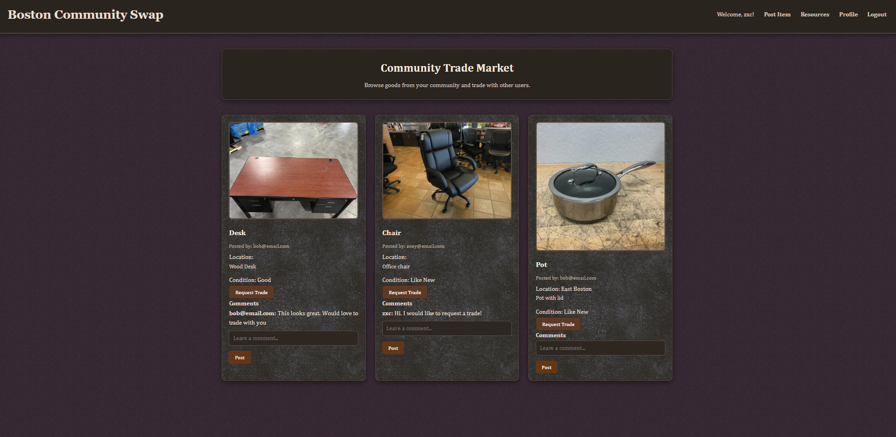

# Community Trade

A simple web application that allows users to post items, browse items from their community, and propose trades with other users. Users can manage their own items, comment on items, and track incoming and outgoing trades. 

---

## Description

**Community Trade** is a Node.js and Express-based web app that integrates with MongoDB for data storage. It allows authenticated users to manage their profiles, post items for trade, and interact with other users’ items. Community resources are linked in resource navigation including information on food banks and local libraries in the Boston area in a time of harsh food insecurity. 

Each item includes:
- A **title**
- A **description**
- A **condition**
- Optional **image upload**
- **Comments** from other users

This project demonstrates basic CRUD operations, form handling with file uploads, and templating using **EJS**.

---

## Features

- **User Authentication** — Each user logs in and can only manage their own content.  
- **Post Items** — Upload an image, give it a title, description, and condition.  
- **View Items** — Browse all items posted by the community.  
- **Propose Trades** — Users can request trades on other users’ items.  
- **Accept / Reject Trades** — Owners can manage incoming trade requests.  
- **Comments** — Users can leave messages on items.  
- **Delete Items / Trades** — Allows removal of items or resolved trades.  
- **Responsive Design** — Simple layout and easy-to-use interface.  

---

## Tech Stack

| Component | Technology |
|------------|-------------|
| **Frontend** | HTML5, CSS3, EJS |
| **Backend** | Node.js, Express.js |
| **Database** | MongoDB (via Mongoose) |
| **Authentication** | Passport.js |
| **Environment Variables** | dotenv |
| **File Upload Handling** | Multer |

---

## Installation & Setup

1. Clone repo: git clone https://github.com/WinnieYuDev/community-trade-fullstack
2. Install dependencies: npm install
3. Start the server:node server.js
4. Open your browser and navigate to: http://localhost:8080

## Future Updates

- Improve UI/UX styling for better responsiveness.  
- Allow user profiles to display name and avatar.  
- Add notifications for trade requests.  
- Add private messaging once trade has been accepted
- Implement search and filtering for items.
